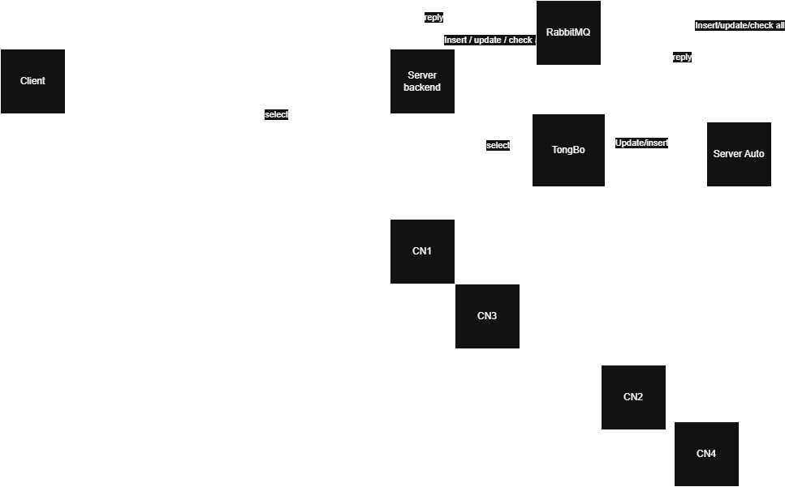

# ⚡ Electricity Service System - Distributed Database Architecture

Final project for the **Distributed Database Systems** course. This system simulates a high-performance electricity service management platform featuring a **horizontal fragmentation architecture**, integrated with an **Event-Driven Asynchronous Billing Engine**, **Real-time Data Replication**, and **Robust Hybrid Cryptography**.

---

## 📖 Table of Contents
- [System Architecture](#-system-architecture)
- [Tech Stack](#-tech-stack)
- [Key Features](#-key-features)
- [Installation & Deployment](#-installation--deployment)
- [Folder Path Summary](#-folder-path-summary)

---

## 🏗️ System Architecture

The core of this system relies on a hybrid distributed model to ensure load balancing, low latency, and data integrity across multiple geographical branches.

> **Note:** Replace the image path below with your actual image file once uploaded to Github.
> 
 
*Figure 1: High-level System Architecture illustrating the Master-Slave Oracle nodes, RabbitMQ Broker, and API Gateway.*

### Data Flow Overview:
1. **Client (Web/App):** Built with **React**, querying local branch databases directly (CN1, CN2, CN3, CN4) for lightning-fast read operations (Local Autonomy).
2. **API Gateway (Backend):** Routes write-heavy operations to the central message queue.
3. **RabbitMQ Broker:** Buffers incoming requests and events to prevent database lockups during peak times.
4. **Automated Workers:** Listens to queues, processes complex tiered-billing logic, fetches cached electricity rates, and executes batch inserts.

---

## 💻 Tech Stack

* **Frontend (Client):** React.js, Vanilla CSS3 (Custom styling with advanced gradients & flexbox), Axios.
* **Backend & Workers:** Node.js, Express.js, node-cron.
* **Relational Database (Core):** Oracle Database (Master Node & Branch Nodes).
* **NoSQL Database (Time-series):** MongoDB (Used for storing millions of IoT electrical meter readings).
* **Caching Layer:** Redis v4 (For static state pricing policies).
* **Message Broker:** RabbitMQ.
* **Security & Cryptography:** Hybrid Encryption (RSA Asymmetric + AES-256 Symmetric keys).

---

## ✨ Key Features

* **Interactive React Dashboard:** A highly responsive administrative panel to monitor billing processes, visualize electricity consumption trends, and manage customer contracts in real-time.
* **Advanced Hybrid Encryption (RSA + AES):** Implements a military-grade security layer. RSA is utilized for secure key exchange, while AES ensures high-speed symmetric encryption for large data payloads between the React Client and Node.js Server.
* **Horizontal Database Fragmentation:** Dynamic routing of data to localized Oracle nodes based on the customer's branch code using advanced Oracle Triggers and DB Links.
* **Smart Tiered Billing Algorithm:** An automated engine that calculates monthly bills combining government-standard tiered pricing and customized contract quotas.
* **Historical Data Snapshotting:** Enforces strict accounting principles by permanently freezing rates and quotas (`kwDinhMuc`, `dongiaKW`) inside the Invoice records upon generation.
* **High-Throughput Batch Processing:** The `BillWorker` utilizes `executeMany()` and multithreading (Promise.all) to process and insert thousands of invoices and details seamlessly.
* **Active Database Mechanism:** Leverages Oracle PL/SQL Triggers to automatically compute and aggregate invoice totals from individual detail rows dynamically.

---

## 🚀 Installation & Deployment

### Prerequisites
Make sure you have installed:
- Node.js (v18 or higher)
- Oracle Database (with properly configured DB Links for branches)
- MongoDB locally or via Atlas
- Redis server
- RabbitMQ server

---

## 📁 Folder Path Summary

| Path | Description |
| --- | --- |
| `AutoService/` | Background workers and automation services (RabbitMQ consumers, scheduled tasks). |
| `backend/` | API server and core business logic (includes RSA/AES encryption utilities). |
| `frontend/` | **React SPA (Single Page Application) - UI components, state management, and API integration.** |
| `setup/` | Infrastructure setup assets (configs, backups, and utilities). |
| `images/` | Documentation images and diagrams. |

---
*Built with ❤️ for the Distributed Database Systems Course.*